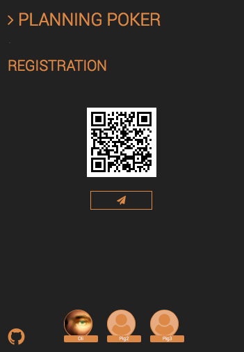

# User's guide

## $ Registration

By surfing to http://pp.mungo.eu, you'll be redirected to the Board. This is the main view of the application. It shows the connected pigs, the workflow of the planning poker session and the final results. It is recognisable by the orange color.

The board displays a QR-code which contain a URL for starting a _Pig_ session. Each participant or Pig of the Planning poker session has to scan the code and surf to the given URL. In case a Pig is not able to scan the QR-code, a mail with the link can be sent by email by hitting the _paper plane_ icon.

When starting a _Pig_ session, any pig may take the control of the session by toggling the upper-right button. Once a pig has taken the control of the session, the toggle button becomes unavailable for other pigs.  

The _Pig view_ is recognisable by the green color.

  

By hitting the avatar icon in the upper-right corner, one may change his name and also specify an email address. This email address will be used to check if a gravatar image is available [(https://www.gravatar.com)](https://www.gravatar.com).

  
  
When all participants are connected, the session manager hits the START button in order to start the planning poker session.

  

On the board, all the connected pigs are displayed at the bottom of the screend.

  
## $ Rounds and votes 